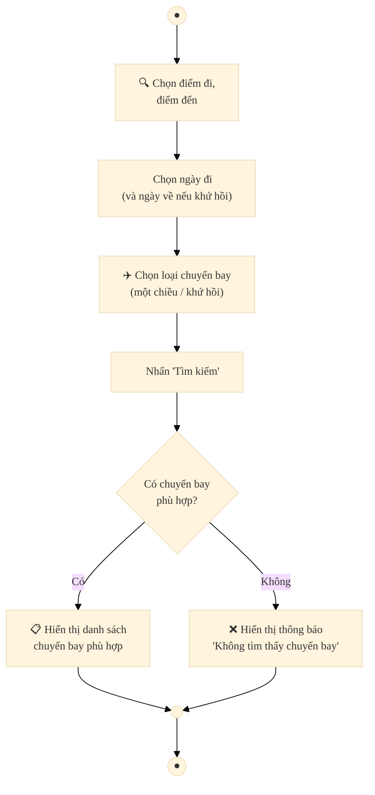

# UML Activity Diagram với Custom Font

```mermaid
%%{init: {'theme':'base', 'themeVariables': { 'fontFamily': 'Times New Roman, serif', 'fontSize': '14px'}}}%%
flowchart TD
    Start((●))

    A["🔍 Chọn điểm đi,<br/>điểm đến"]
    B["📅 Chọn ngày đi<br/>(và ngày về nếu khứ hồi)"]
    C["✈️ Chọn loại chuyến bay<br/>(một chiều / khứ hồi)"]
    D["🔎 Nhấn 'Tìm kiếm'"]

    Decision{"Có chuyến bay<br/>phù hợp?"}

    E["📋 Hiển thị danh sách<br/>chuyến bay phù hợp"]
    F["❌ Hiển thị thông báo<br/>'Không tìm thấy chuyến bay'"]

    Merge(( ))
    End((●))

    Start --> A
    A --> B
    B --> C
    C --> D
    D --> Decision

    Decision -->|Có| E
    Decision -->|Không| F

    E --> Merge
    F --> Merge
    Merge --> End

    classDef default font-family:Times New Roman,serif,font-size:14px
```

